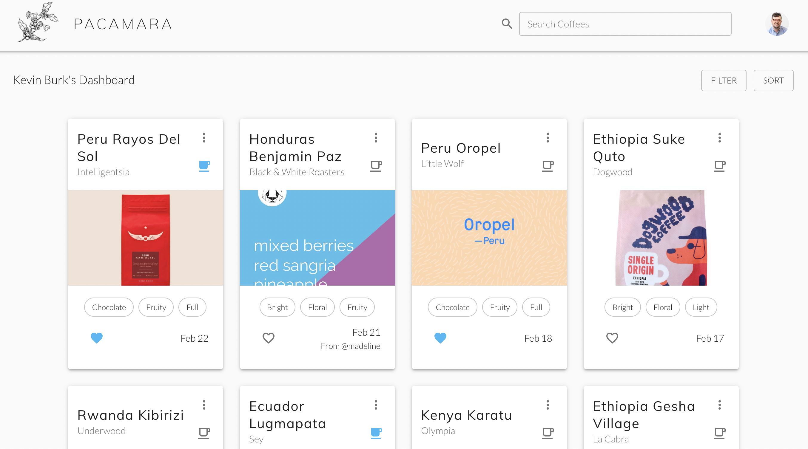

# Pacamara

## Description

_Duration: 1 week of scope, 2 weeks to build the project_

Pacamara is a coffee tracking app, allowing the user to track information in two
main categories: origin information, such as producer, country of origin, 
and processing method, as well as brewing information, such as grind setting, 
grams of coffee and water, and brew method used.

If the user owns a refractometer, the user can also enter their TDS reading 
alongside their brew specs to calculate their extraction percentage, which is a 
big indicator on the success of a particular brew instance.

Pacamara was created for my Solo Project at Prime Digital Academy. It was a 
passion project of mine and I'm so glad to see it come to fruition.

To see the fully functional site, please visit 
[Pacamara](https://quiet-forest-05735.herokuapp.com/).

## Screenshots

### Coffee Dashboard

### Coffee Details

### Share Coffee

## Prerequisites

Link to software that is required to install the app (e.g. node).

- [Node.js](https://nodejs.org/en/)
- [Postgres](https://www.postgresql.org/)

## Installation

You will need the following `env` keys to run Pacamara:
- `SERVER_SESSION_SECRET` _(some secure string, I recommend 
[Password Generator](https://passwordsgenerator.net/))_

For photo upload, this project uses AWS S3 with a dropzone uploader. If you do 
not have an S3 account, visit 
[AWS S3](https://aws.amazon.com/s3/getting-started/) to get set up.
- `AWS_SECRET_ACCESS_KEY`
- `AWS_ACCESS_KEY_ID`
- `AWS_S3_REGION`
- `REACT_APP_S3_URL`

1. Create a database named `pacamara`,
2. The queries in the `database.sql` file are set up to create all the necessary 
tables and populate the needed data to allow the application to run correctly. 
The project is built on [Postgres](https://www.postgresql.org/download/), so you 
will need to make sure to have that installed. We recommend using Postico to run 
those queries as that was used to create the queries, 
3. Open up your editor of choice and run an `npm install`
4. Run `npm run server` in your terminal
5. Run `npm run client` in your terminal
6. The `npm run client` command will open up a new browser tab for you!

## Usage

1. Create a new account on Pacamara
2. Enter information regarding your brewing equipment, along with the brew 
methods you own.
3. Set your desired TDS and Extraction % ranges.
4. Add a new coffee, entering all origin information, general flavor notes, 
and a photo of the bag.
5. Add a new brew instance, recording the specs you used and whether it was 
successful.
6. Note your calculated extraction percentage, so you can adjust later brew 
specs accordingly.
7. Share a coffee you're excited about with another user of Pacamara.

## Built With

- React
- React Router
- Redux-Saga
- Material-UI
- Node.js
- Express
- Postgres
- AWS S3
- Victory Charts

## Acknowledgement

Thanks to [Prime Digital Academy](www.primeacademy.io) who equipped and helped 
me to make this application a reality. Special thanks to our instructor Dane 
Smith, my friends and family, and the awesome Zhu cohort at Prime.

## Support

If you have suggestions or issues, please [email me](kevinmburk@gmail.com)!